# CKAD Note Section 3 Configuration

<br>

---

## 37. [Pre-Request] Commands and Arguments in Docker

<br>


課程一開始就先來複習 `Docker File` 當中的 `CMD` 與 `ENTRYPOINT`，雖然講師說不在 CKAD 的考試範圍，不過 [CKAD-2021 (即將在 2021 Q3 改版)](https://training.linuxfoundation.org/ckad-program-change-2021/) 看起來是有被納入的喔~

Docker 官方文件有小實驗與列表可以參考\
[Docker official docs-Understand how CMD and ENTRYPOINT interact](https://docs.docker.com/engine/reference/builder/#understand-how-cmd-and-entrypoint-interact)


當我們執行

```bash
docker run ubuntu --name test
```

隨即查看 docker running process (`docker ps`) 會發現 `test` 這個容器實例並不在 running 狀態。接著列出所有 container (包含 not running) `docker ps -a` 則會發現 `test` 處於 `Exited` 狀態。\
container 不像 VM 一樣需要維持 OS 運作，當手上沒有需要「存活」的任務時就會退出 running status => Exit\
`CMD` 和 `ENTRYPOINT` 的作用就是定義 container 裡面需要執行什麼任務。 (可以去找 `Docker file` 閱讀)


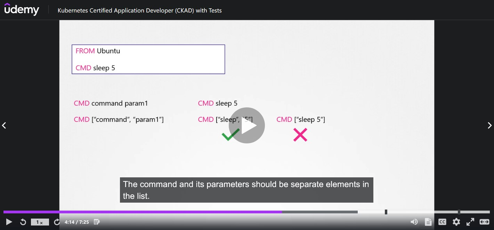

▲ `CMD` 有兩種格式: shell format, JSON format。

<br>

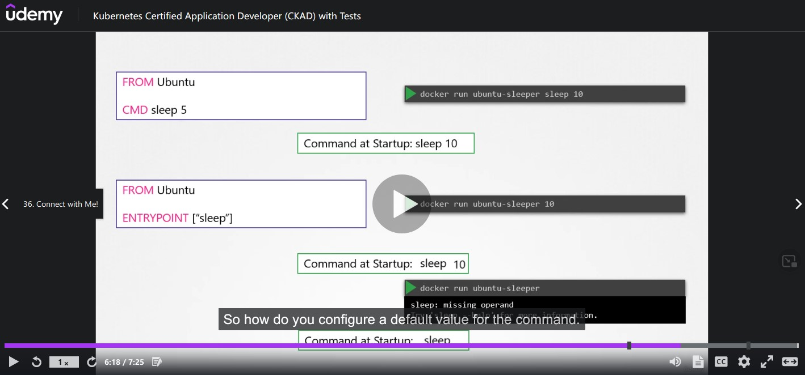

▲ `ENTRYPOINT` 的作用。

<br>

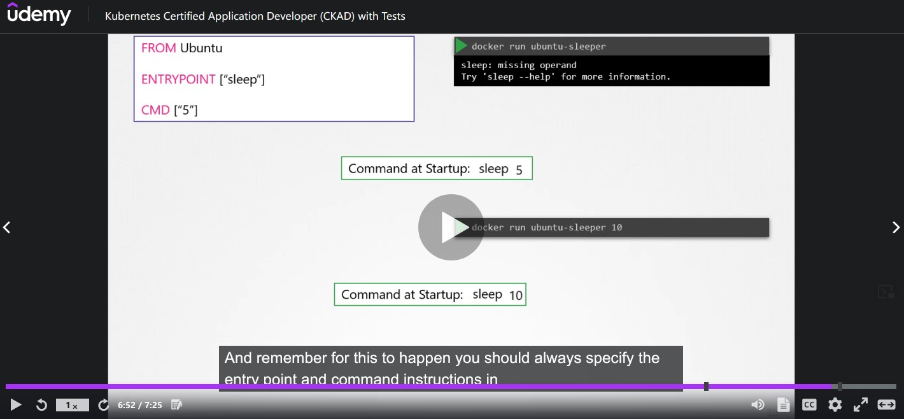

▲ `CMD` `ENTRYPOINT` 同時使用

<br>

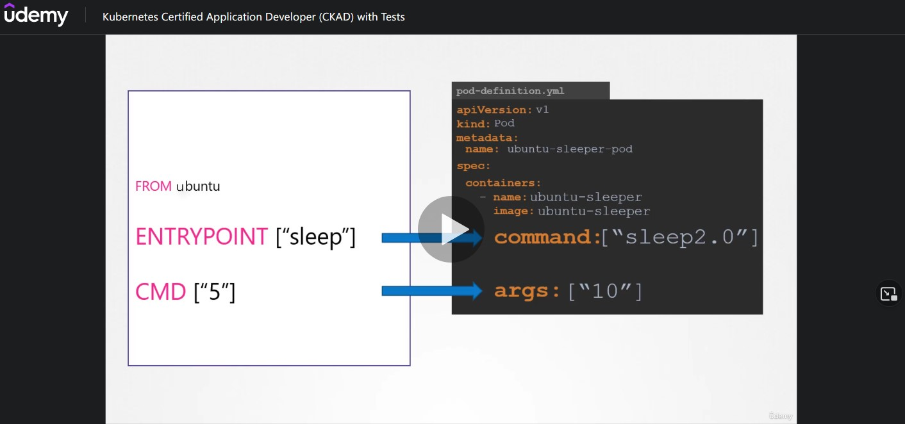

▲ 兩者應對關係

<br>

---

### 42. Enviroment Variables


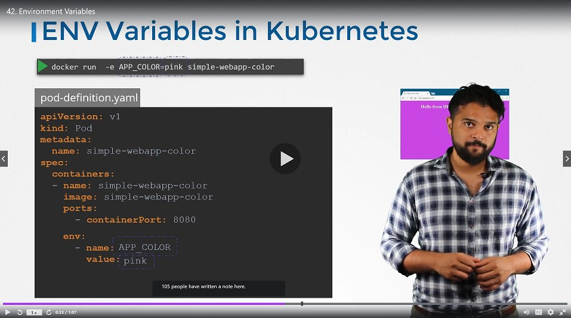

▲ `env` 被放在 `.spec.containers.env`。 **<span style='color:red'>而且是個 array</span>**

<br>

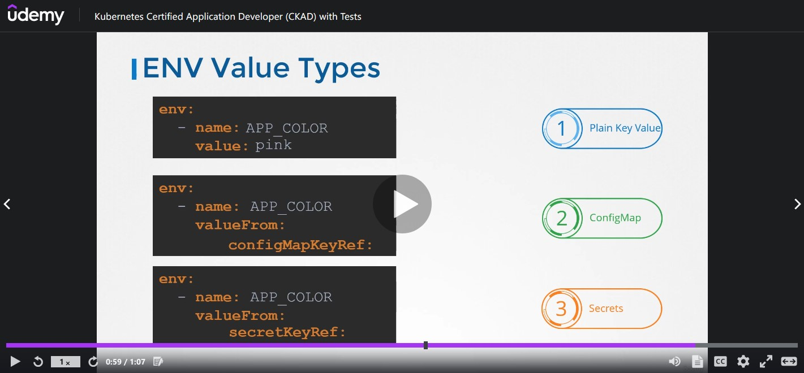

▲ `env` 總共有三種類型: **<span style='color:red'>plain key-value, configMap, secret</span>**

<br>

如果把 `env` 散落在每一個 `YAML` 裡面會變得不好管理，**`configMap` 就是為了中央化管理而誕生。** 


BTW~ 在 `kubectl` CLI 的世界裡面有兩種創建元件的方式: **1. Imperative (命令式)   2. Declarative (宣告式)** (不確定考試是否會要求)\
[[ithelp]Buzz Word 1 : Declarative vs. Imperative](https://ithelp.ithome.com.tw/articles/10233761)

<br>

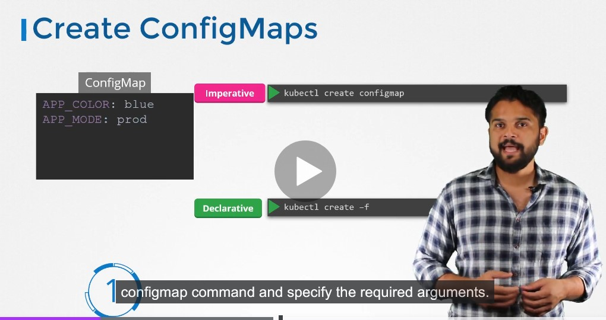

<br>

#### Imperative way


```bash
kubectl create configmap NAME [--from-file=[key=]source] [--from-literal=key1=value1] [--dry-run=server|client|none]
```


configMap file 的內容可以參考 [[kubernetes.io]Configure a Pod to Use a ConfigMap](https://kubernetes.io/docs/tasks/configure-pod-container/configure-pod-configmap/) (其實就是每一行一個 key-value 啦)

<br>

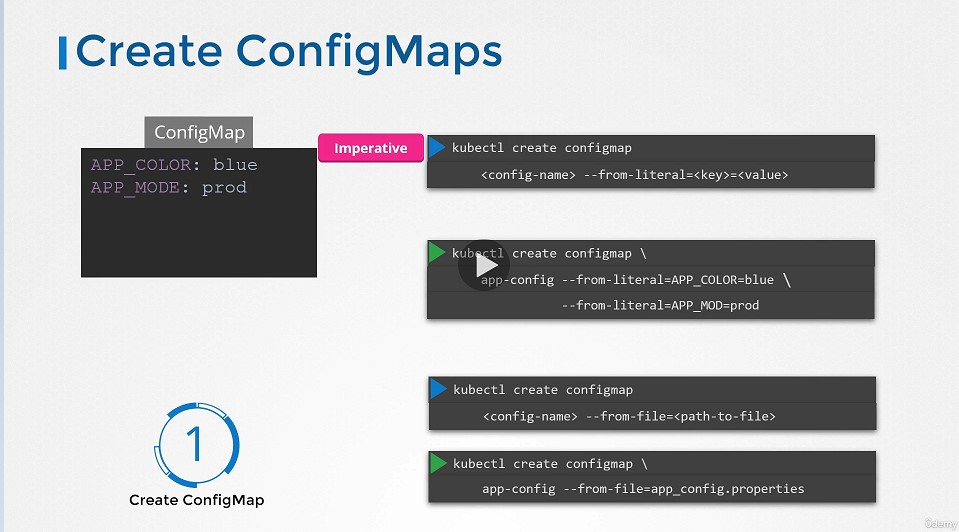

<br>

#### Declarative way


**<span style='color:red'>把 `spec:` 換成 `data:`</span>**

```yaml
apiVersion: v1
kind: ConfigMap
metadata:
  name: my-config
data:
  name: xzk
```


<br>

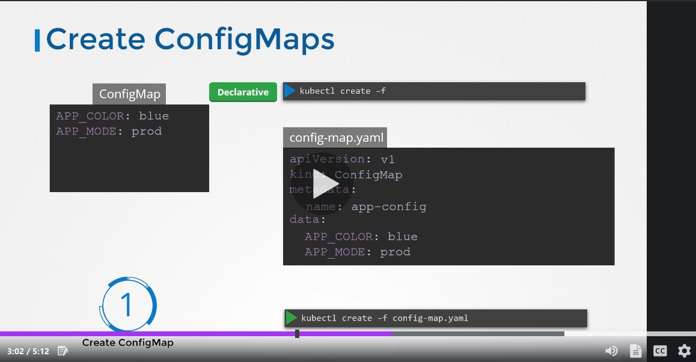

<br>


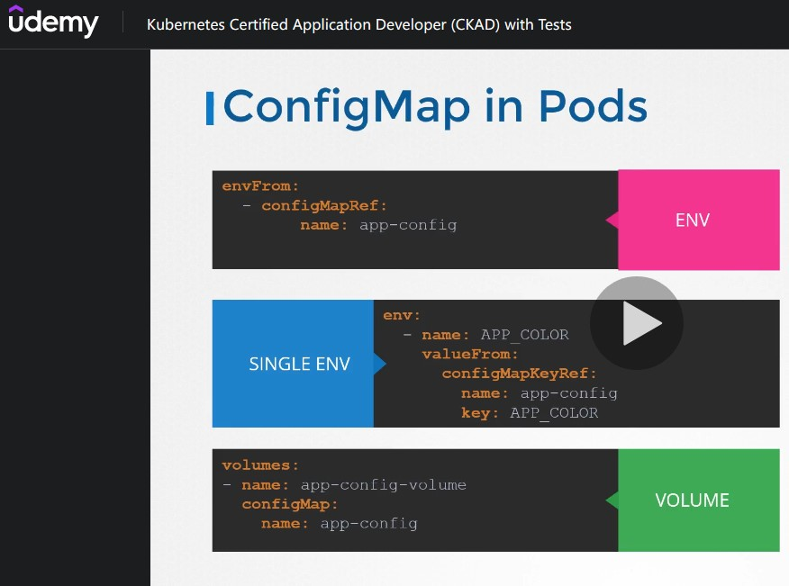

▲ 將整個 `ENV` file inject 到 `pod`、將 `ENV` file 的 **某個 key-value** inject 到 `pod`、用 `volume` 的方式掛載 `configMap`

<br>

#### 解題技巧


```bash
kubectl explain <k8s_component> --recursive | grep 'envFrom' -A3
```


```text
         envFrom        <[]Object>
            configMapRef        <Object>
               name     <string>
               optional <boolean>

```


為什麼要 `--recursive` 呢? 因為 **預設輸出並不會展開每一個欄位裡面的細項**，因此會找不到我們要的 `envFrom`\
搞剛一點可以 `kubectl explain pod.spec.containers.envFrom` (JSON path) 去看

<br>

#### secret


```bash
kubectl create secret generic my-secret --from-literal=DB_HOST=mysql --from-literal=DB_USER=root --from-literal=DB_PASSWD=passwd --dry-run=client -o yaml
```


```yaml
apiVersion: v1
data:
  APP_COLOR: Ymx1ZQ==
  DB_HOST: bXlzcWw=
  DB_PASSWD: cGFzc3dk
  DB_USER: cm9vdA==
kind: Secret
metadata:
  creationTimestamp: null
  name: my-secret
```


可以看到預設 `value` 都是以 Base 64 **<span style='color:red'>encode (編碼) 不是加密!!</span>**


```bash
## base 64 encode
echo -n 'mysql' | base64

## base 64 decode
echo -n 'bXlzcWw=' | base64 --decode
```


```yaml
apiVersion: v1
kind: Pod
metadata:
  creationTimestamp: null
  labels:
    name: simple-webapp-color
  name: secret-web-color
spec:
  containers:
  - image: mmumshad/simple-webapp-color
    name: secret-web-color
    envFrom:
    - secretRef:
        name: my-secret
```

<br>


### 47. A quick note about Secrests


這邊主要介紹如何 encrypt "secret" in K8s & K8s 本身運作 secret 的機制。


- secret 只會單向傳輸到 pod 所在的 node 身上
- `kubelet` 儲存 secret 在 tmpfs，而不是 disk
- 當 pods 不再需要某個 secret，`kubelet` 會刪除 local tmpfs 內的 secret


<br>

### 50. Docker Security


Docker 預設在 container 內使用 root 來執行 process，這個 root 跟 host root 不一樣，是權限有被限縮的 root。\
下圖是 Linux root 所有 root 的超能力 (capabilities)，在 `/usr/include/linux/capability.h` 有定義。\
在 `docker run` 的時候可以 1. 更改使用者 PID (--user 1000)  2. 增減 root 超能力 `docker run --cap-add MAC_ADMI ubuntu`

<br>

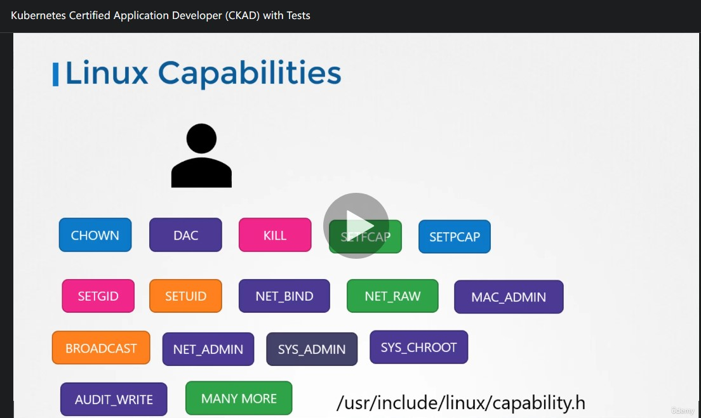

<br>

### 51. Security Contexts


在 Kubernetes 裡面定義前面 docker 提到的 security。可以選擇定義在 `pod` 裡面 (`pod` 內所有 container 都會被套用) 或者單一 `container` 裡面

<br>

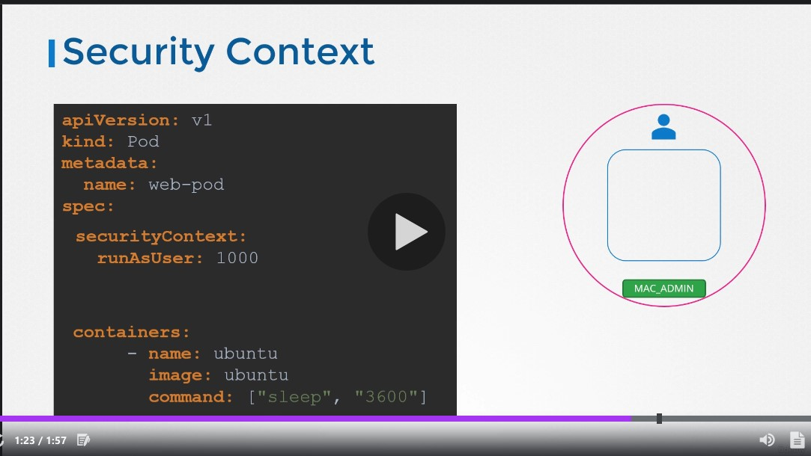

▲ 定義在 `pod` 內

<br>

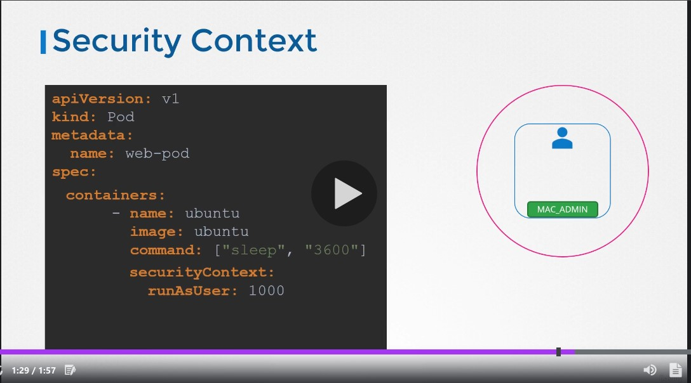

▲ 定義在 `container` 內

<br>

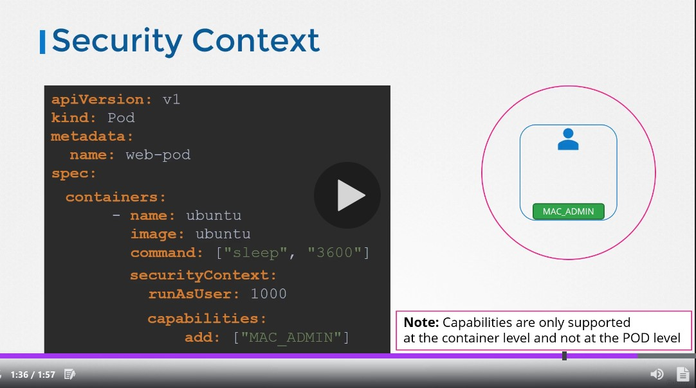

▲ **<span style='color:red'>Capabilities 只能定義在 container 內</span>**

<br>

---

## 53. Service Account


在 Kubernetes 中有兩種帳號， **User Account** 與 **Service Account** 前者給人用，後者給 "非人" 使用 (~~洗咧公鯊小~~)\
通常是給 Application 使用，例如: 負責監控 `Pod` 的 **Prometheus**。\
Prometheus (普羅米修斯) 需要跟 Kubernetes API 互動來獲取 `pod` 資訊，所以需要一組 **Service Account**


**<span style='color:blue'>每個 `namespace` 都會有一組名為 `default` 的 Service Account</span>**

<br>

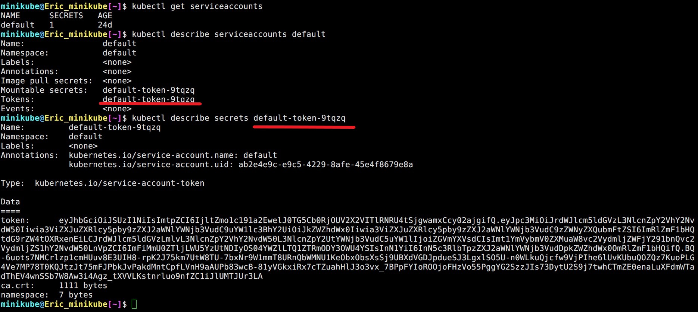

<br>

`curl` 範例:


```bash
curl https://192.168.49.2:8443/api -insecure --header "Authorization: Bearer <YOUR_TOKEN>"
```

<br>

**<span style='color:red'>`default` Service Account 預設會 auto mount 進 `pod` 裡面</span>**

<br>

```bash
kubectl describe pod xxxx
```


<br>

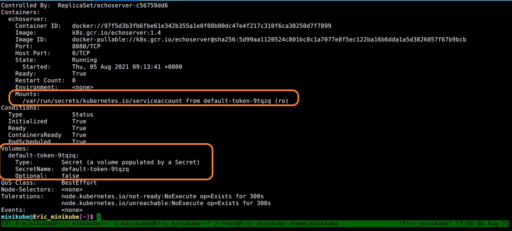

<br>


```bash
kubectl exec echoserver-c56759dd6-5c8h9 -- ls -al /var/run/secrets/kubernetes.io/serviceaccount

total 4
drwxrwxrwt 3 root root  140 Aug  5 01:13 .
drwxr-xr-x 3 root root 4096 Aug  5 01:13 ..
drwxr-xr-x 2 root root  100 Aug  5 01:13 ..2021_08_05_01_13_39.467286527
lrwxrwxrwx 1 root root   31 Aug  5 01:13 ..data -> ..2021_08_05_01_13_39.467286527
lrwxrwxrwx 1 root root   13 Aug  5 01:13 ca.crt -> ..data/ca.crt
lrwxrwxrwx 1 root root   16 Aug  5 01:13 namespace -> ..data/namespace
lrwxrwxrwx 1 root root   12 Aug  5 01:13 token -> ..data/token
```


**Deployment** (練習 LAB 考題)


```bash
kubectl explain deployment.spec.template.spec | grep 'serviceAccount'

   serviceAccount       <string>
     Deprecated: Use serviceAccountName instead.
   serviceAccountName   <string>

```

<br>

---

## 56. Resource Requirements

<br>

[Managing Resources for Containers](https://kubernetes.io/docs/concepts/configuration/manage-resources-containers/)

<br>

`scheduler` 會針對使用者給定的 request 去分配這個 `pod` 應該去哪個 node


**<span style='color:red'>YAML 路徑</span>**


>
    spec.containers[].resources.limits.cpu
    spec.containers[].resources.limits.memory
    spec.containers[].resources.limits.hugepages-<size>
    spec.containers[].resources.requests.cpu
    spec.containers[].resources.requests.memory
    spec.containers[].resources.requests.hugepages-<size>


**範例:**


```yaml
apiVersion: v1
kind: Pod
metadata:
  name: frontend
spec:
  containers:
  - name: app
    image: images.my-company.example/app:v4
    resources:
      requests:
        memory: "64Mi"
        cpu: "250m"
      limits:
        memory: "128Mi"
        cpu: "500m"
  - name: log-aggregator
    image: images.my-company.example/log-aggregator:v6
    resources:
      requests:
        memory: "64Mi"
        cpu: "250m"
      limits:
        memory: "128Mi"
        cpu: "500m"
```

<br>

**<span style='color:red'>只有設定 limit (上限) 而沒有設定 request (需求) 的情況下，`Kubernetes` 會自動 `request == limit`</span>**


**> (錯的! 請看 57.) Kubernetes 預設分配 <span style='color:blue'>0.5 CPU 與 256 Mi memory</span> 到每個 `pod`** (CPU 單位最低是 `1m == 0.001`， **若設定成 1 代表 1 vCore**)\
**<span style='color:red'>> Kubernetes 會自動調節 CPU usage 讓 CPU 使用率不超出我們設定的閥值，不過 memory 並不會! 當 memory 吃超過 `limits` 這個 `pod` 將會被消滅 (terminate)</span>**

<br>

---

## 57. Note on default resource requirements and limits

<br>

```markdown
大家下午好，想請問一下如果不在 `namespace` 設定 `LimitRange` ， 預設 `pod` 是可以將整個 host 的硬體資源吃滿嗎? (runtime 是 Docker 的話)
```

**<span style='color:red'> Yes! 沒有設定的話就是用多少吃多少。</span>**

<br>

---

## 58. Practice Test - Resource Requirements

<br>

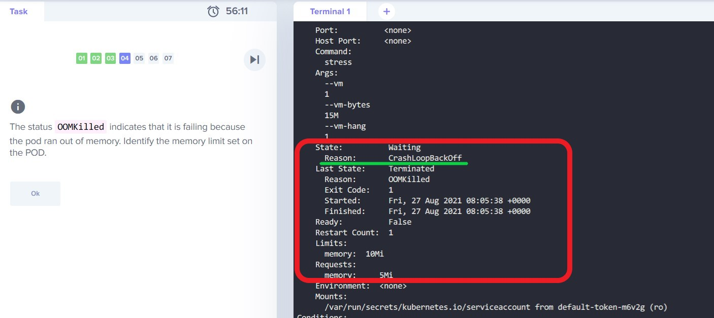

▲ 如果 `kubectl get pod` 看到 `status` 是 `CrashLoopBackOff` 的話 **<span style='color:red'>原因 (reason) 不是這個!!</span>**\
請用 `kubectl describe pod <pod_name>` 下去看

<br>

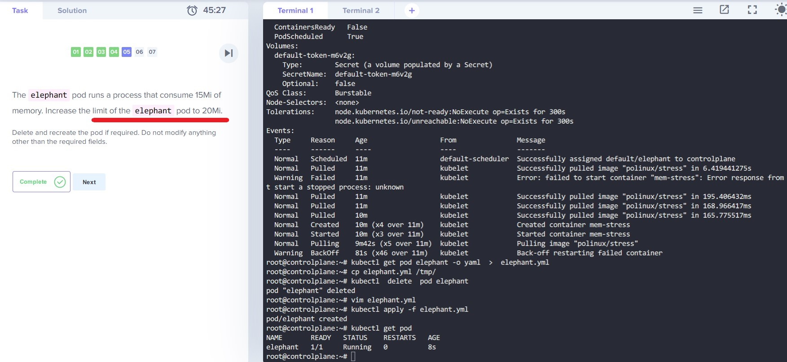

▲ 調整 `pod` resources 必須砍掉重練。

<br>

---

## 59. Taints and Toleration (汙點 與 容忍度)

<br>

**<span style='color:blue'>這兩個是影響 `scheduler` 調度/~~指定~~ (下一章節要討論的 node affinity 才能夠指定 node) `pod` 的機制。</span>** 我們會將 **worker node 設定 `taints`；對 `pod` 設定 `toleration`。**

<br>

### Taint to a worker node


[Taints and Tolerations](https://kubernetes.io/docs/concepts/scheduling-eviction/taint-and-toleration/)

<br>

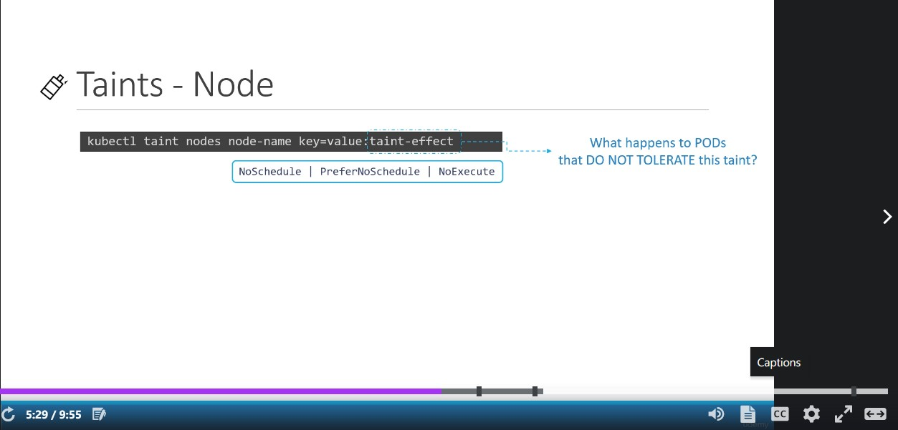


透過 `kubectl taint <NODE> <NAME> key=value:<taint_effect>` 可以將 worker node 「汙點」。\
`<taint_effect>` 定義了當 `pod` 不能忍受 (not tolerate) 時 **觸發 scheduler 的策略**\
其中 `<taint_effect>` 的部分有三種: **1. NoSchedule** **2. PreferNoSchedule** **3. NoExecute**


1. `NoSchedule`: 從此以後不符合資格的 `pod` 將不會被 `scheduler` 調度過來。 **不朔及既往**
2. `PreferNoSchedule`: 小橋流水人家....不要! 但接受內地的 「word 很大，你忍耐一下」 「我叫你吹!」 (~~兩個都是內地沒毛病~~)
3. `NoExecute`: 不符合資格的 `pod` 將不會被 `scheduler` 調度過來。 **<span style='color:red'>會朔及既往</span>**

<br>

範例:


```bash
kubectl taint nodes node1 key1=value1:NoSchedule

## remove
kubectl taint nodes node1 key1=value1:NoSchedule-
```

<br>

### Tolerate a pod


假設我們對 `node1` 執行 `taint` 如下:

```bash
kubectl taint nodes node1 key1=value1:NoScheduler
```

<br>

那要讓某個 `pod` 適應 `node1` 的 YAML 會就長這樣 ↓ (**<span style='color:red'>註: 如果 `operator` 是 "Exist" 的話 `value` 不用被宣告。</span>**)


```yaml
apiVersion: v1
kind: Pod
metadata:
  name: nginx
  labels:
    env: test
spec:
  containers:
  - name: nginx
    image: nginx
    imagePullPolicy: IfNotPresent
  tolerations:
  - key: "key1"
    operator: "Equal"
    value: "value1"
    effect: "NoSchedule"
```


**<span style='color:red'>注意!! 每個 `tolerations` 底下的 value 都必須要加 `"xxxx"` 而且 `operator: "xxx"` 是必要的</span>**

<br>

**<span style='color:green'>★ 觀念澄清!!</span>** 在 Taint and Toleration 當中 **<span style='color:red'>我們只是讓 `node1` 可以接受 「大奶微微」(taint the node)，但絕對沒有保證 「大奶微微」一定會被 放置/調度 在 `node1` 喔!!</span>**

<br>

另外 master-node 也是透過 taint 來達成排擠非系統 `pod` 的目的。

<br>

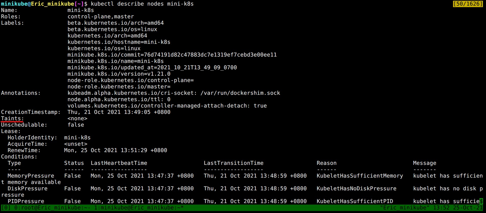

▲ minikube 貌似沒有加 XDD 不過正常應該會看到 `Taints: node-role.kubernetes.io/master:NoSchedule` 啦~

<br>

---

## 62. Node Selector

<br>

Node Selectors 提供一個比較簡單的方式來讓使用者指定 `pod` 放到哪個 worker node。\
兩個步驟: **1. Label a node**  **2. add to YAML**

<br>

### Label a node


```bash
kubectl label nodes <node-name> <key>=<value>

## show label on node
kubectl describe nodes <node-name> | grep -i 'label'

Labels:             beta.kubernetes.io/arch=amd64
```

<br>

### add 'nodeSelector' to YAML


範例來源: [[kubernetes.io] Assigning Pods to Nodes](https://kubernetes.io/docs/concepts/scheduling-eviction/assign-pod-node/)


```yaml
apiVersion: v1
kind: Pod
metadata:
  name: nginx
  labels:
    env: test
spec:
  containers:
  - name: nginx
    image: nginx
    imagePullPolicy: IfNotPresent
  nodeSelector:
    disktype: ssd
```

<br>

### Node selector 的限制


先假設我們有四個 node `node{1..4}`:


node1: `size: large`\
node2: `size: small`\
node3: `size: small`\
node4: `size: medium`


**<span style='color:red'>Node selector 沒辦法做到條件判斷!</span>** 例如:

`size: arge` OR `size: medium`\
NOT `size: small`


這個時候就需要 **Node Affinity** 了~

<br>

---

## Node Affinity

<br>

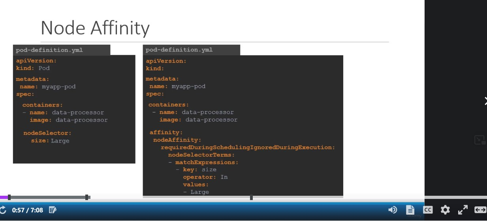

▲ 因為多了 `operator` 可以做判斷式。


`operator` 可以是 `In`, `NotIn`, `Exists` (常用) 其中 `Exists` 只判斷是否有這個 `key` 而不用給定 `value`。


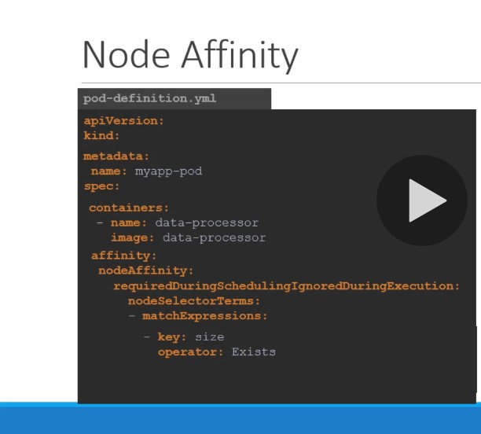

<br>


```bash
kubectl explain pod.spec.affinity
```

```
KIND:     PodVERSION:  v1
RESOURCE: affinity <Object>
DESCRIPTION:
     If specified, the pod's scheduling constraints

     Affinity is a group of affinity scheduling rules.

FIELDS:
   nodeAffinity <Object>
     Describes node affinity scheduling rules for the pod.

   podAffinity  <Object>
     Describes pod affinity scheduling rules (e.g. co-locate this pod in the
     same node, zone, etc. as some other pod(s)).

   podAntiAffinity      <Object>
     Describes pod anti-affinity scheduling rules (e.g. avoid putting this pod
     in the same node, zone, etc. as some other pod(s)).
```


**本章節只會用到 `nodeAffinity` 的部分~**


```bash
kubectl explain pod.spec.affinity.nodeAffinity
```

```
KIND:     Pod
VERSION:  v1

RESOURCE: nodeAffinity <Object>

DESCRIPTION:
     Describes node affinity scheduling rules for the pod.

     Node affinity is a group of node affinity scheduling rules.

FIELDS:
   preferredDuringSchedulingIgnoredDuringExecution      <[]Object>
     The scheduler will prefer to schedule pods to nodes that satisfy the
     affinity expressions specified by this field, but it may choose a node that
     violates one or more of the expressions. The node that is most preferred is
     the one with the greatest sum of weights, i.e. for each node that meets all
     of the scheduling requirements (resource request, requiredDuringScheduling
     affinity expressions, etc.), compute a sum by iterating through the
     elements of this field and adding "weight" to the sum if the node matches
     the corresponding matchExpressions; the node(s) with the highest sum are
     the most preferred.

   requiredDuringSchedulingIgnoredDuringExecution       <Object>
     If the affinity requirements specified by this field are not met at
     scheduling time, the pod will not be scheduled onto the node. If the
     affinity requirements specified by this field cease to be met at some point
     during pod execution (e.g. due to an update), the system may or may not try
     to eventually evict the pod from its node.
```


**`nodeAffinity` 分為兩種 rule: `preferredDuringSchedulingIgnoredDuringExecution` 與 `requiredDuringSchedulingIgnoredDuringExecution`** ~~有夠長~~


**看起來很長，不過<span style='color:red'>實際上只有前面不同</span>: `preferred` 和 `required`**，官方在未來有考慮增加 `required ... required...`。\
來解釋一下差異~


什麼時候會觸發 `DuringScheduling` 呢? **Ans:** 使用到 master node 的 scheduler 時。 例如: 新增 `pod`\
什麼時候會觸發 `DuringExecution` 呢? **Ans:** 破壞到現有條件時。 例如: un-label 某個 worker node，而這個 worker node 上面的 `pod` 有設定這個 label\
不過目前 nodeAffinity 對於 `DuringExecution` 都是 **<span style='color:red'>Ignor</span>**。換句話說就是不會因為 K8s admin un-label 了某個 node 而觸發 `pod` 被調度到其它 node 身上，或者讓 `pod` 完全沒有容身之地造成崩潰。


`preferred` (偏好), `required` (要求) 應該非常好理解。**<span style='color:blue'>假設 worker-node 忘記 label 了，前者一樣可以被調度安置；後者就會讓 `pod` 處於 pending 狀態喔~</span>**


**<span style='color:brown'>Tips: 查詢 worker-node 身上的 label -> `kubectl get nodes <node> --show-labels`</span>**

<br>

---

## 63. Taint and Toleration / Node Affinity 比較

<br>

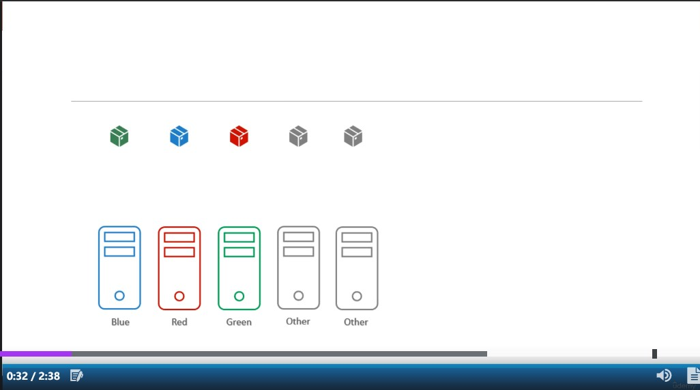

▲ 我們的目標是將同顏色的 `pod` 放到同顏色的 `node` 上 **<span style='color:red'>AND</span>** 灰色 `pod` 不會被安放到彩色世界。

<br>


- **<span style='color:purple'>Taint and Toleration:</span>** 可以保證 node 上只有正確的 `pod`，**但不能保證彩色的 `pod` 不會被丟去灰色的 Other (worker-node)!**

<br>

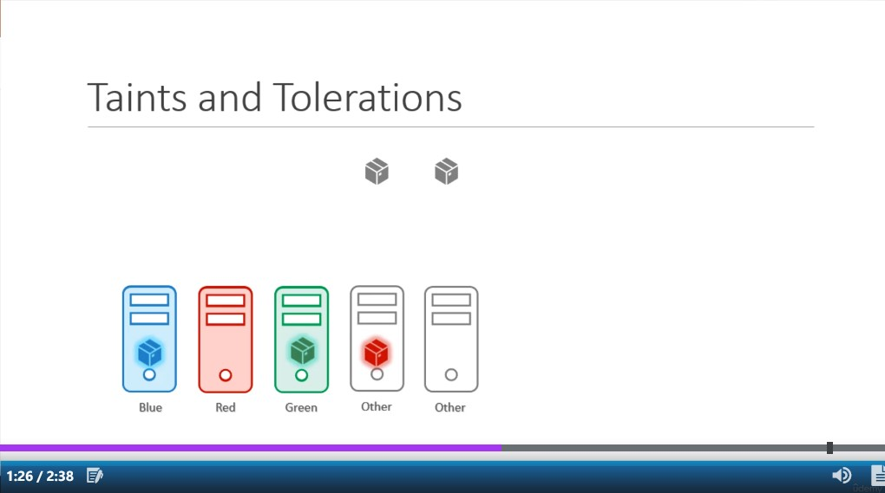

▲ Red `pod` 有機會被放置到 Other worker-node 身上。

<br>

- **<span style='color:purple'>Node Affinity:</span>** 可以保證彩色的 `pod` 只能被放在彩色的 worker-node 身上， **但不能保證灰色的 `pod` 不會被丟去彩色的 worker-node 身上!**

<br>

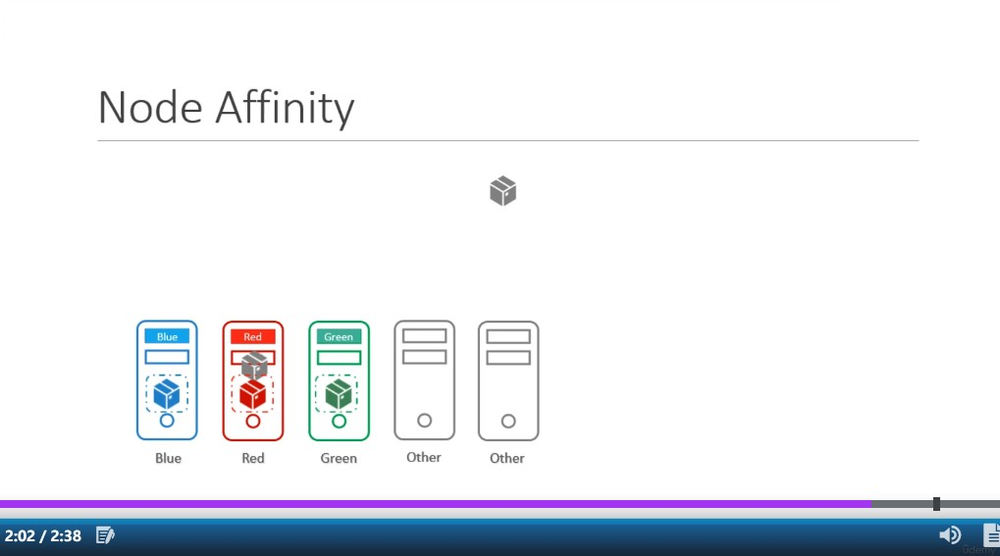

▲ Gray `pod` 有機會被放置到彩色 worker-node 身上。

<br>


**<span style='color:red'>因此同時使用兩個政策即可達成目的!</span>**

<br>

---

## 65. Certification Tips

<br>

這邊講師列了三篇考試心得與小技巧~ 


- [My CKAD exam experience](https://www.linkedin.com/pulse/my-ckad-exam-experience-atharva-chauthaiwale/)


  1. 千萬不要手刻整份 YAML!! `kubectl run`, `kubectl create ... --dry-run=client -o yaml > def.yml`
  2. 善用 `alias` (我大概只會用兩個 `alias kk='kubectl'`, `alias kkr='kubectl -o yaml --dry-run=client'`)
  3. `~/.vimrc` (本人不使用)
     
     ```bash
     vim ~/.vimrc
     set nu
     set expandtab
     set shiftwidth=2
     set tabstop=2
     ```
     <br>

     ```bash
     ## 2021/11/22 新增 (不用死記，進去 vim tab 的出來)
     ## 新增之後就不用拿尺對 YAML file 了!
     
     set cursorcolumn
     set cursorline
     ```
     <br>
  4. 使用考場 (網頁) 提供的 note pad 記下題號與佔分，如果你要跳題的話

<br>

